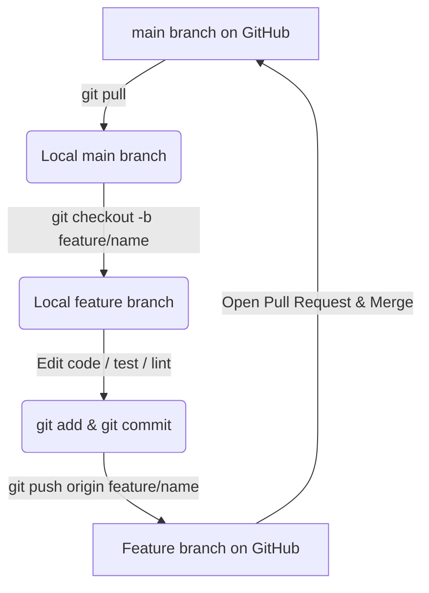

# Git Commands & Workflow Guide

This guide outlines the complete Git workflow for managing this repository locally and collaborating on GitHub.

---

## 🚀 1. Initial Repository Setup
If you haven't initialized Git in this project yet, follow these steps to connect your local project to a new GitHub repository.

### Step A: Initialize Git Locally
Run the following commands in the root of your project directory (`ambient-expense-agent/`):
```bash
# Initialize a local Git repository
git init -b main

# Check the status to see files waiting to be tracked
git status
```

### Step B: Make the Initial Commit
Stage your files and commit them locally. The `.gitignore` is already pre-configured to exclude virtual environments, keys, and temporary files.
```bash
# Add all files to staging (except those ignored by .gitignore)
git add .

# Create the initial commit
git commit -m "feat: initial commit of ambient-expense-agent"
```

### Step C: Connect to GitHub & Push
1. Go to [GitHub](https://github.com/) and create a new repository (do **not** initialize it with a README, `.gitignore`, or license, since they already exist in this folder).
2. Copy the remote repository URL (looks like `https://github.com/username/repo-name.git` or `git@github.com:username/repo-name.git`).
3. Run the following commands to link and push your code:
```bash
# Link your local repository to the remote GitHub repository
git remote add origin <GITHUB_REPO_URL>

# Push the local 'main' branch to GitHub and set it as the default upstream
git push -u origin main
```

---

## 🔄 2. Daily Development Workflow (Feature Branching)
To keep the `main` branch clean and stable, always use a **Feature Branch** workflow.



### Step 1: Update your local `main` branch
Before starting any new work, ensure your local copy has the latest changes from GitHub:
```bash
git checkout main
git pull origin main
```

### Step 2: Create a feature branch
Create a descriptive branch name (e.g., `feature/add-new-tool`, `bugfix/fix-auth`):
```bash
git checkout -b feature/your-feature-name
```

### Step 3: Make changes, test, and commit
As you write code, commit your progress in logical increments:
```bash
# Check modified files
git status

# View the differences
git diff

# Stage specific files, or stage all changes
git add <filename>   # Recommended: stage specific files
git add .            # Or stage all changes

# Commit with a clean, descriptive message
git commit -m "feat: implement user query parser helper"
```

### Step 4: Push the feature branch to GitHub
```bash
git push -u origin feature/your-feature-name
```

### Step 5: Create a Pull Request (PR)
1. Go to your repository on GitHub. You should see a prompt: **"Compare & pull request"**.
2. Click it, describe your changes, and create the PR.
3. Review code changes, resolve conflicts if any, and merge the PR into the `main` branch on GitHub.
4. Once merged, switch back to `main` locally, pull the updates, and safely delete your feature branch:
```bash
git checkout main
git pull origin main
git branch -d feature/your-feature-name
```

---

## 🛠️ 3. Essential Git Command Reference

### Checking Status & Differences
| Command | Purpose |
|---|---|
| `git status` | Shows current branch, modified files, and staged files. |
| `git diff` | Shows unstaged changes line-by-line. |
| `git diff --staged` | Shows changes that are staged and ready to commit. |
| `git log --oneline -n 10` | Shows the last 10 commits in a compact format. |

### Working with Branches
| Command | Purpose |
|---|---|
| `git branch` | Lists all local branches (highlighting the active one). |
| `git branch -a` | Lists all local and remote-tracking branches. |
| `git checkout <branch-name>` | Switches to an existing branch. |
| `git checkout -b <branch-name>` | Creates a new branch and switches to it. |
| `git branch -d <branch-name>` | Deletes a local branch (safely checks if merged). |

### Saving Work Temporarily (Stashing)
If you need to switch branches but aren't ready to commit your current half-finished changes, use Git Stash:
```bash
# Save your uncommitted changes to a temporary storage stack
git stash

# Switch branches, do other work, and switch back
# ...

# Restore your stashed changes
git stash pop
```

### Undoing & Resetting
> [!WARNING]
> Be careful when using reset commands, as they can overwrite local changes permanently.

| Command | Purpose |
|---|---|
| `git restore <filename>` | Discards local unstaged changes in a specific file. |
| `git reset HEAD <filename>` | Unstages a file (keeps the changes in your working directory). |
| `git commit --amend -m "new message"` | Modifies your very last commit message (before pushing). |
| `git reset --soft HEAD~1` | Undoes the last commit, but keeps your changes staged. |
| `git reset --hard HEAD` | **Destructive**: Discards all uncommitted changes since the last commit. |
